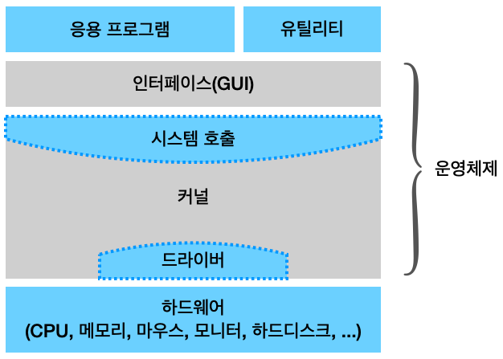

# 쉽게 배우는 운영체제 Ch.1

## Table of Contents

1. [운영체제 소개](#1.-운영체제-소개)
2. [운영체제의 역사](#2.-운영체제의-역사)
3. [운영체제의 구조](#3.-운영체제의-구조)
4. [용어 설명](#4.-용어-설명)

## 1. 운영체제 소개

### 운영체제(OS, Operating System)

사용자에게 편리한 인터페이스 환경을 제공하고 컴퓨터 시스템의 자원을 효율적으로 관리하는 소프트웨어

- 대표적인 컴퓨터 운영체제 → Windows, MacOS, Unix, Linux 등
- 대표적인 모바일 운영체제 → iOS, Android

### 운영체제의 필요성
| 질문 | 답 |
| --- | - |
| 컴퓨터는 운영체제가 없어도 작동하는가? | 컴퓨터는 운영체제가 없어도 작동하지만 기능에 제약이 따른다. |
| 운영체제가 있는 기계와 없는 기계는 어떤 차이가 있는가? | 운영체제가 있는 기계는 다양한 응용 프로그램을 설치하여 사용할 수 있고 성능 향상을 위한 새로운 기능을 쉽게 추가할 수 있다. |
| 운영체제는 성능을 향상하는 데에만 필요한가? | 운영체제는 컴퓨터의 성능을 향상할 뿐만 아니라 자원을 관리하고 사용자에게 편리한 인터페이스 환경을 제공한다. |
| 운영체제는 자원을 어떻게 관리하는가? | 운영체제는 사용자가 직접 자원에 접근하는 것을 막음으로써 컴퓨터 자원을 보호한다. |
| 사용자는 숨어 있는 자원을 어떻게 이용할 수 있는가? | 운영체제가 제공하는 사용자 인터페이스와 하드웨어 인터페이스를 이용하여 자원에 접근한다. |

### 운영체제의 역할

- **자원 관리** 효율성  
운영체제는 컴퓨터 자원을 응용 프로그램에 나누어주어 사용자가 원활하게 작업할 수 있도록 돕는다. 만약 자원을 요청한 프로그램이 여러 개라면 적당한 순서로 자원을 배분, 적절한 시점에 자원을 회수하여 다른 응용 프로그램에 나누어준다.
- **자원 보호** 안정성  
운영체제는 악의적인 사용자나 미숙한 사용자로부터 자원을 보호한다.
- **하드웨어 인터페이스 제공** 확장성  
우리는 다양한 종류의 하드웨어를 사용한다. 이때 운영체제는 복잡한 과정 없이 다양한 장치를 사용할 수 있도록 해주는 하드웨어 인터페이스를 제공한다.
- **사용자 인터페이스 제공** 편리성  
하드웨어 인터페이스가 다양한 장치를 편리하게 사용하기 위한 것이라면, 사용자 인터페이스는 사용자가 운영체제를 편리하게 사용하도록 지원하기 위한 것이다. 

### 운영체제의 목표

- **효율성**  
운영체제의 목표는 자원을 효율적으로 관리하는 것이다. 같은 자원을 사용하더라도 더 많은 작업량을 처리하거나, 같은 작업량을 처리하는 데 보다 적은 자원을 사용하는 것이다.   
효율적인 자원 관리는 다양한 방법이 있는데, 일반적으로 운영체제의 크기를 최소화하고 운영체제가 사용하는 코드를 최적화해야 한다. 
- **안정성**  
운영체제가 불안정하면 모든 작업이 분안할 수 밖에 없고, 그 피해가 고스란히 사용자에게 돌아가기 때문에 운영체제는 안정성이 담보되어야 한다.  
안정성은 운영체제의 역할 중 '자원 보호'와 연관된다. 운영체제가 안정적이려면 사용자와 응용 프로그램의 안전 문제와 하드웨어적인 보안 문제를 처리할 수 있어야 하며, 시스템에 문제가 발생했을 때 이전으로 복구하는 결함 포용fault tolerant 기능을 수행해야 한다.
- **확장성**  
운영체제는 다양한 시스템 자원을 추가하거나 제거하기가 편리해야 한다. 이는 운영체제의 역할 중 '하드웨어 인터페이스 제공'과 연관되는 것으로, 운영체제는 하드웨어의 종류에 상관없이 꽂으면 바로 실행할 수 있는 플러그 앤드 플레이plug and play 기능을 제공해야 한다.
- **편리성**  
운영체제는 사용자가 편리하게 작업할 수 있는 환경을 제공해야 한다. 이는 운영체제의 역할 중 '사용자 인터페이스 제공'과 연관된다. 

## 2. 운영체제의 역사

| 구분 | 시기 | 주요 기술 | 특징 |
| --- | --- | ------- | --- |
| 0 | 1940년대 | 없음 | 진공관(0과 1) 사용 |
| 1 | 1950년대 | 카드 리더, 라인 프린터 | 일괄 작업 시스템, 운영체제의 등장 |
| 2 | 1960년대 초반 | 키보드, 모니터 | 대화형 시스템 |
| 3 | 1960년대 후반 | C 언어 | 다중 프로그래밍 기술 개발, 시분할 시스템 |
| 4 | 1970년대 | PC | 개인용 컴퓨터의 등장, 분산 시스템 |
| 5 | 1990년대 | 웹 | 클라이언트/서버 시스템 |
| 6 | 2000년대 | 스마트폰 | P2P 시스템(메신저, 파일 공유), 그리드 컴퓨팅, 클라우드 컴퓨팅, 사물 인터넷 |

## 3. 운영체제의 구조

그림을 보면 운영체제는 크게 두 부분으로 나뉜다. 사용자와 응용 프로그램에 인접하여 커널에 명령을 전달하고 실행 결과를 사용자와 응용 프로그램에 돌려주는 인터페이스와, 운영체제의 핵심 기능을 모아놓은 커널이 그것이다.

커널은 사용자나 응용 프로그램으로부터 컴퓨터 자원을 보호하기 위해 자원에 직접 접근하는 것을 차단한다. 따라서 자원을 이용하려면 시스템 호출이라는 인터페이스를 이용하여 접근해야 한다. 시스템 호출은 커널이 제공하는 시스템 관련 서비스를 모아놓은 것이며 함수 형태로 제공된다. 

응용 프로그램과 커널의 인터페이스가 시스템 호출이라면 커널과 하드웨어의 인터페이스는 드라이버Driver가 담당한다. 커널이 모든 하드웨어에 맞는 인터페이스를 개발하기는 어렵기 때문에, 하드웨어 제작자가 관련 소프트웨어를 만드는 게 더 유리하다.  
커널은 입출력의 기본적인 부분만 제작하고, 하드웨어의 특성을 반영한 소프트웨어를 하드웨어 제작자에게 받아 커널이 실행될 때 함께 실행되도록 한다. 이때 하드웨어 제작자가 만든 소프트웨어를 디바이스 드라이버라고 부른다.

### 커널의 구성
| 핵심 기능 | 설명 |
| ------- | --- |
| 프로세스 관리 | 프로세스에 CPU를 배분하고 작업에 필요한 제반 환경을 제공한다. |
| 메모리 관리 | 프로세스에 작업 공간을 배치하고 실제 메모리보다 큰 가상공간을 제공한다. |
| 파일 시스템 관리 | 데이터를 저장하고 접근할 수 있는 인터페이스를 제공한다. |
| 입출력 관리 | 필요한 입력과 출력 서비스를 제공한다. |
| 프로세스 간 통신 관리 | 공동 작업을 위한 각 프로세스 간 통신 환경을 지원한다. |
커널의 핵심 기능은 유기적으로 복잡하게 얽혀 있다. 커널은 이러한 기능을 어떻게 구현하는가에 따라 단일형 구조 커널, 계층형 구조 커널, 마이크로 구조 커널로 구분된다.

- 단일형 구조monolithic architecture 커널  
초창기의 운영체제 구조로, 커널의 핵심 기능을 구현하는 모듈들이 구분 없이 하나로 구성되어 있다.
    - 장점
        - 모듈이 거의 분리되지 않았기 때문에 모듈 간의 통신 비용이 줄어들어 효율적인 운영이 가능하다.
    - 단점
        - 모든 모듈이 하나로 묶여 있기 때문에 버그나 오류를 처리하기가 어렵다.
        - 운영체제의 여러 기능이 서로 연결되어 있어 상호 의존성이 높기 때문에 기능상의 작은 결함이 시스템 전체로 확산될 수 있다.
        - 다양한 환경의 시스템에 적용하기 어렵다.
        - 현대의 운영체제는 매우 크고 복잡하기 때문에 완전 단일형 구조의 운영체제를 구현하기가 어렵다.
- 계층형 구조layered architecture 커널  
비슷한 기능을 가진 모듈을 묶어서 하나의 계층으로 만들고 계층 간의 통신을 통해 운영체제를 구현하는 방식
    - 장점
        - 단일형 구조보다 버그나 오류를 쉽게 처리할 수 있따.
        - 디버깅debugging 하기 쉽다.
- 마이크로 구조micro architecture 커널  
마이크로 구조 커널의 운영체제는 프로세스 관리, 메모리 관리, 프로세스 간 통신 관리 등 가장 기본적인 기능만 제공한다. 마이크로 구조에서 각 모듈은 독립적으로 작동하기 때문에 하나의 모듈이 실패하더라도 전체 운영체제가 멈추지 않는다. 또한 많은 컴퓨터에 이식하기 쉽고 커널이 가벼워 CPU 용량이 작은 시스템에도 적용이 가능하다.

## 4. 용어 설명

- **임베디드 운영체제embedded operating system** 또는 **임베디드 시스템embedded system**  
CPU의 성능이 낮고 메모리 크기도 작은 시스템에 내장하도록 만든 운영체제
- **컴퓨터 자원**  
키보드, 네트워크카드, 사운드카드 등
- **드라이버Driver**  
하드웨어 장치와 상호작용하기 위해 만들어진 컴퓨터 프로그램
- **유틸리티Utility**  
바이러스 검사, 디스크 조각 모음, 압축 프로그램과 같이 운영체제의 작업을 보조하는 소프트웨어
- **하드와이어링hard wiring 방식**  
전선을 연결하여 논리회로를 구성하는 것
- **천공카드 리더punch card reader**  
천공카드에 구멍을 뚫어 문자나 숫자를 표현하고 이것을 기계가 읽어서 데이터를 수집하는 장치
- **OMROptical Mark Reader**  
OMR 카드에 특수한 펜으로 표시하여 기계가 마크를 읽어서 데이터를 수집하는 장치
- **일괄 작업 시스템batch job system** 또는 **일괄 처리 시스템batch processing system**  
모든 작업을 한꺼번에 처리해야 하고 프로그램 실행 중간에 사용자가 데이터를 입력하거나 수정하는 것이 불가능한 시스템
- **.bat**  
'batch job'을 의미함
- **대화형 시스템interactive system**  
컴퓨터와 사용자의 대화를 통해 작업이 이루어지는 시스템
- **CPU 집중 작업CPU bound job**  
대부분의 작업이 CPU만 사용하는 계산 작업. CPU 집중 작업, CPU 편향 작업 또는 컴퓨터 집중 작업computer bound job이라고 부른다.
- **입출력 집중 작업I/O bound job**  
대부분의 작업 시간을 주변장치의 입력과 출력에 사용하며, 동영상 플레이어와 데이터베이스 같은 프로그램을 예로 들 수 있다.
- **다중 프로그래밍multi programming**  
하나의 CPU로 여러 작업을 동시에 실행하는 기술
- **시분할 시스템time sharing system** 또는 **다중 작업multi tasking 시스템**  
여러 작업을 조금씩 처리하여 작업이 동시에 이루어지는 것처럼 보이게 하는 것. CPU 사용 시간을 잘게 쪼개어 작업들에 나누어줌으로써 모든 작업이 동시에 처리되는 것처럼 보인다. 이때 잘게 나뉜 시간 한 조각을 타임 슬라이스time slice 또는 타임 퀀텀time quantum이라고 한다.
- **실시간 시스템real-time system**  
일정 시간 안에 작업이 처리되도록 보장하는 시스템
- **경성 실시간 시스템hard real-time system**  
지정한 응답 시간을 정확히 지키는 시스템
- **연성 실시간 시스템soft real-time system**  
지정한 응답 시간을 최대한 지키지만 융통성이 어느 정도 허용된 시스템
- **멀티프로그래밍 수준level of multiprogramming** 또는 **멀티프로그래밍 정도degree of multiprogramming**  
시분할 시스템에서 동시에 실행되는 작업의 개수
- **분산 시스템distributed system**  
네트워크상에 분산되어 있는 여러 컴퓨터로 작업을 처리하고 그 결과를 상호 교환하도록 구성한 시스템
- **클라이언트/서버 시스템client/server system**  
작업을 요청하는 클라이언트와 거기에 응답하여 요청받은 작업을 처리하는 서버의 이중 구조 시스템
- **데몬daemon**  
멈추지 않고 계속 작동하는 프로그램
- **P2P 시스템Peer-to-Peer system**  
서버를 거치지 않고 사용자와 사용자를 직접 연결한 시스템
- **그리드 컴퓨팅grid computing**  
서로 다른 기종의 컴퓨터들을 묶어 대용량의 컴퓨터 풀computer pool을 구성하고 이를 원격지와 연결하여 대용량 연산을 수행하는 컴퓨팅 환경
- **SaaSSoftware as a Service**  
사용자가 필요할 때 소프트웨어 기능을 이용하고 그만큼만 비용을 지불하는 개념
- **클라우드 컴퓨팅cloud computing**  
언제 어디서나 응용 프로그램과 데이터를 자유롭게 사용할 수 있는 컴퓨팅 환경으로 그리드 컴퓨팅과 SaaS를 합쳐놓은 형태
- **사물 인터넷Internet of Things, IoT**  
사물에 센서와 통신 기능을 내장하여 인터넷에 연결하는 기술
- **커널kernel**  
프로세스 관리, 메모리 관리, 저장장치 관리와 같은 운영체제의 핵심적인 기능을 모아놓은 것
- **운영체제의 인터페이스interface**  
커널에 사용자의 명령을 전달하고 실행 결과를 사용자에게 알려주는 역할
- **시스템 호출system call**  
커널이 자신을 보호하기 위해 만든 인터페이스
- **APIApplication Programming Interface**  
응용 프로그램이 자신과 연관된 프로그램을 만들 수 있도록 제공하는 인터페이스. API는 시스템 호출보다 광범위한 개념이며, 운영체제의 API를 시스템 호출이라고 정의할 수 있다.
- **SDKSystem Developer's Kit**  
프로그램 개발자를 위해 API 및 API 사용 메뉴얼뿐만 아니라 프로그램 개발에 필요한 코드 편집기와 에뮬레이터 같은 각종 개발용 응용 프로그램까지 하나로 묶어서 배포하는 개발 툴