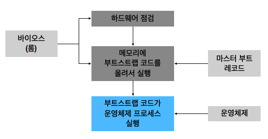

# 쉽게 배우는 운영체제 Ch.2

## Table of Contents

1. [컴퓨터의 기본 구성](#1.-컴퓨터의-기본-구성)
2. [CPU와 메모리](#2.-CPU와-메모리)
3. [컴퓨터 성능 향상 기술](#3.-컴퓨터-성능-향상-기술)
4. [병렬 처리](#4.-병렬-처리)
5. [용어 설명](#5.-용어-설명)

## 1. 컴퓨터의 기본 구성

### 1. 하드웨어의 구성
- 중앙처리장치CPU  
명령어를 해석하여 실행하는 장치
- 메모리(제 1저장장치first storage)  
작업에 필요한 프로그램과 데이터를 저장하는 장소, 바이트 단위로 분할되어 있으며 분할 공간마다 주소로 구분
- 입출력장치  
    - 입력장치: 키보드, 마우스, 스캐너 등  
    외부의 데이터를 컴퓨터에 입력하는 장치
    - 출력장치: 모니터, 스피커, 프린터 등  
    컴퓨터에서 처리한 결과를 사용자가 원하는 형태로 출력하는 장치
- 저장장치  
데이터를 영구적으로 저장하는 장치
- 메인보드  
컴퓨터의 다양한 부품을 연결하는 장치

### 2. 폰노이만 구조
CPU, 메모리, 입출력장치, 저장장치가 버스로 연결되어 있는 구조, 모든 프로그램은 메모리에 올라와야 실행 할 수 있다.

## 2. CPU와 메모리

### 1. CPU의 구성과 동작
#### 1.1 CPU의 기본 구성
CPU는 산술논리 연산장치, 제어장치, 레지스터로 구성되며, 이것들의 협업으로 작업을 처리한다.
- 산술논리 연산장치Arithmetic and Logic Unit, ALU  
CPU에서 데이터를 연산하는 장치, 데이터의 덧셈, 뺄셈, 곱셈, 나눗셈 같은 산술 연산과 AND, OR 같은 논리 연산을 수행
- 제어장치control unit  
CPU에서 작업을 지시하는 장치
- 레지스터register  
CPU 내에 데이터를 임시로 보관하는 곳

#### 1.2 CPU의 명령어 처리 과정

덧셈을 한다고 하면,
- CPU가 연산을 하려면 필요한 데이터를 CPU로 가져와 임시로 보관해야 하는데, 이때 사용되는 것이 레지스터
- 모든 데이터가 준비되면 산술논리 연산장치에서 두 값을 더하여 그 결과값을 레지스터에 저장했다가 메모리로 옮긴다.
- 제어장치는 명령어를 해석하여 제어 신호를 보내고 CPU 내의 데이터 흐름을 조절하는 역할을 한다.

#### 1.3 레지스터의 종류

사용자 가시 레지스터user-visible register  
사용자 프로그램에 의해 변경되기 때문에 아래의 레지스터는 사용자 가시 레지스터라고 불림
- **데이터 레지스터data register**  
메모리에서 가져온 데이터를 임시로 보관할 때 사용
- **주소 레지스터address register**  
데이터 또는 명령어가 저장된 메모리의 주소를 저장할 때 사용

사용자 불가시 레지스터user-invisible register: 특수 레지스터  
사용자가 임의로 변경할 수 없음
- **프로그램 카운터PC, program counter**: 명령어 포인터instruction pointer  
다음에 실행할 명령어의 주소를 기억하고 있다가 제어장치에 알려줌
- **명령어 레지스터IR, instruction register**  
현재 실행 중인 명령어를 저장함
- **메모리 주소 레지스터MAR, memory address register**  
메모리에서 데이터를 가져오거나 반대로 메모리로 데이터를 보낼 때 주소를 지정하기 위해 사용
- **메모리 버퍼 레지스터MBR, memory buffer register**  
메모리에서 가져온 데이터나 메모리로 옮겨 갈 데이터를 임시로 저장. 메모리 버퍼 레지스터는 항상 메모리 주소 레지스터와 함께 동작함

그 외 기타 레지스터
- **프로그램 상태 레지스터PSR, Program Status Register**  
산술논리 연산장치와 연결되어 있으며 연산 결과가 양수인지, 음수인지, 0이 아닌지 또는 자리 올림의 유무 등을 저장  
플래그 레지스터flag register, 상태 레지스터status register, 컨디션 레지스터condition register라고도 불린다.

#### 1.4 버스의 종류
버스는 CPU와 메모리, 주변장치 간에 데이터를 주고받을 때 사용한다.

**버스의 종류와 특징**
| 버스 | 특징 |
| --- | --- |
| 제어 버스control bus | 제어장치와 연결된 버스로, CPU가 메모리와 주변장치에 제어 신호를 보내기 위해 사용한다. 메모리와 주변장치에서도 작업이 완료되거나 오류가 발생하면 제어 신호를 보내기 때문에 양방향이다. |
| 주소 버스address bus | 메모리 주소 레지스터(MAR)와 연결된 버스로, 메모리나 주변장치에 데이터를 읽거나 쓸 때 위치 정보를 보내기 위해 사용하며 단방향이다. |
| 데이터 버스data bus | 메모리 버퍼 레지스터(MBR)와 연결된 버스로, 데이터의 이동이 양방향으로 이루어진다. |

### 2. 메모리의 종류와 부팅

모든 프로그램은 메모리에 올라와야 실행될 수 있다.

#### 2.1 메모리의 종류
- 램RAM, Random Access Memory  
읽거나 쓸 수 있는 메모리, 무작위로 데이터를 읽어도 저장된 위치와 상관없이 같은 속도로 데이터를 읽을 수 있다.  
램은 전력이 끊기면 데이터가 사라지는 휘발성 메모리와 전력이 끊겨도 데이터를 보관할 수 있는 비휘발성 메모리로 나뉜다.
    - 휘발성 메모리volatility memory
        - DRAMDynamic RAM  
        저장된 0과 1의 데이터가 일정 시간이 지나면 사라지므로 일정 시간마다 다시 재생시켜야 한다.
        - SRAMStatic RAM  
        전력이 공급되는 동안에는 데이터를 보관할 수 있어 재생할 필요가 없다.
        - SDRAMSynchronous Dynamic Random Access Memory  
        DRAM이 발전된  형태로 SRAM과는 완전히 다른 종류의 램이다. SDRAM은 클록틱(펄스)이 발생할 때마다 데이터를 저장하는 동기 DRAM이다.
    - 비휘발성 메모리non-volatility memory  
        플래시 메모리flash memory, FRAMFerroelectric memory, PRAMPhase change RAM 등  
        플래시 메모리의 각 소자는 최대 사용 횟수가 제한되어 보통 소자 하나당 몇 천 번에서 몇 만 번 정도 사용하면 제 기능을 잃는다.
- 롬ROM, Read Only Memory  
읽기만 가능한 메모리
    - 마스크 롬mask ROM  
    데이터를 지우거나 쓸 수 없는 메모리
    - PROMProgrammable ROM  
    전용 기계를 이용하여 데이터를 한 번만 저장할 수 있는 메모리
    - EPROMErasable Programmable ROM  
    데이터를 여러 번 쓰고 지울 수 있는 메모리, 가격이 비싸서 잘 사용하지 않음

#### 2.2 메모리 보호

일괄 작업 시스템(일괄 처리 시스템)에서는 메모리가 운영체제 영역과 사용자 영역으로 구분된다. 일괄 작업 시스템에서 메모리 보호는 사용자 영역의 작업이 운영체제 영역으로 침범하지 못하도록 막는 것이다.

메모리를 보호하기 위해 CPU는 현재 진행 중인 작업의 메모리 시작 주소를 경계 레지스터bound register에 저장한 후 작업을 한다. 또한 현재 진행 중인 작업이 차지하고 있는 메모리의 크기, 즉 마지막 주소까지의 차이를 한계 레지스터limit register에 저장한다. 그리고 사용자의 작업이 진행되는 동안 이 두 레지스터의 주소 범위를 벗어나는지 하드웨어적으로 점검함으로써 메모리를 보호한다.

모든 메모리 영역은 하드웨어와 운영체제의 협업에 의해 보호받는다.

#### 2.3 부팅booting
컴퓨터를 켰을 때 운영체제를 메모리에 올리는 과정

## 3. 컴퓨터 성능 향상 기술

### 1. 버퍼buffer
#### 1.1 버퍼의 개념
속도에 차이가 있는 두 장치 사이에서 그 차이를 완화하는 역할, 일정량의 데이터를 모아 옮김으로써 속도의 차이를 완화시킨다.

하드디스크에는 메모리 버퍼가 있다. 같은 사양의 하드디스크라면 버퍼의 용량이 큰 것이 빠르다.

#### 1.2 스풀SPOOL, Simultaneous Peripheral Operation On-Line  
CPU와 입출력장치가 독립적으로 동작하도록 고안된 소프트웨어적인 버퍼로, 대표적인 예로 프린터에서 사용되는 스풀러spooler이 있다. 스풀러는 인쇄할 내용을 순차적으로 출력하는 소프트웨어로, 출력 명령을 내린 프로그램과 독립적으로 동작한다. 

### 2. 캐시cache
#### 2.1 캐시의 개념
메모리와 CPU 간의 속도 차이를 완화하기 위해 메모리의 데이터를 미리 가져와 저장해두는 임시 장소. 캐시는 버퍼의 일종으로 CPU가 앞으로 사용할 것으로 예상되는 데이터를 미리 가져다놓는다.

캐시는 CPU 안에 있으며 CPU 내부 버스의 속도로 작동한다. 캐시는 빠른 속도로 작동하는 CPU와 느린 속도로 작동하는 메모리 사이에서 두 장치의 속도 차이를 완화해준다.

캐시는 메모리의 내용 중 일부를 미리 가져오고, CPU는 메모리에 접근해야 할 때 캐시를 먼저 방문하여 원하는 데이터가 있는지 찾아본다. 캐시에서 원하는 데이터를 찾았다면 캐시 히트cache hit라고 하며, 그 데이터를 바로 사용한다. 그러나 원하는 데이터가 캐시에 없으면 메모리로 가서 데이터를 찾는데 이를 캐시 미스cache miss라고 한다. 캐시 히트가 되는 비율을 캐시 적중률cache hit ratio이라고 하며, 일반적인 컴퓨터의 캐시 적중률은 약 90%이다.

캐시 적중률을 높이는 방법 중 하나는 캐시의 크기를 늘리는 것이다. 가격이 비싸기 때문에 크기를 늘리는 데 한계가 있다. 또 다른 방법은 앞으로 많이 사용될 데이터를 가져오는 것이다. 이와 관련된 이론으로는 현재 위치에 가까운 데이터가 멀리 있는 데이터보다 사용될 확률이 더 높다는 지역성locality 이론이 있다.

#### 2.2 즉시 쓰기와 지연 쓰기
캐시는 메모리에 있는 데이터를 임시로 가져온 것이기 때문에 캐시에 있는 데이터가 변경되면 메모리에 있는 원래 데이터를 변경해야 한다.
- 즉시 쓰기write through  
캐시에 있는 데이터가 변경되면 이를 즉시 메모리에 반영하는 방식
- 지연 쓰기write back: 카피백copy back  
캐시에 있는 데이터가 변경되면 이를 즉시 메모리에 반영하는 것이 아니라 변경된 내용을 모아서 주기적으로 반영하는 방식

#### 2.3 L1 캐시와 L2 캐시
명령어 캐시는 명령어 레지스터와 연결되어 있고, 데이터 캐시는 데이터 레지스터와 연결되어 있다. 명령어 캐시나 데이터 캐시는 CPU 레지스터에 직접 연결되기 때문에 L1Level 1 캐시라고 부르며, 일반 캐시는 메모리와 연결되기 때문에 L2Level 2 캐시라고 부른다.

### 3. 저장장치와 계층 구조
저장장치의 계층 구조는 속도가 빠르고 값이 비싼 저장장치를 CPU 가까운 쪽에 두고, 값이 싸고 용량이 큰 저장장치를 반대쪽에 배치하여 적당한 가격으로 빠른 속도와 큰 용량을 동시에 얻는 방법이다.

### 4. 인터럽트
#### 4.1 인터럽트의 개념
CPU가 직접 입출력장치에서 데이터를 가져오거나 내보냈는데, 이러한 방식을 폴링polling 방식이라고 한다. 폴링 방식에서는 CPU가 입출력장치의 상태를 주기적으로 검사하여 일정한 조건을 만족할 때 데이터를 처리한다. CPU가 명령어 해석과 실행이라는 본래 역할 외에는 모든 입출력까지 관여해야 하므로 작업 효율이 떨어진다. 이러한 문제를 해결하기 위해 등장한 것이 인터럽트interrupt 방식이다.  
인터럽트 방식은 CPU의 작업과 저장장치의 데이터 이동을 독립적으로 운영함으로써 시스템의 효율을 높인다.

#### 4.2 인터럽트 방식의 동작 과정
1. CPU가 입출력 관리자에게 입출력 명령을 보낸다.
2. 입출력 관리자는 명령받은 데이터를 메모리에 가져다놓거나 메모리에 있는 데이터를 저장장치로 옮긴다.
3. 데이터 전송이 완료되면 입출력 관리자는 완료 신호를 CPU에 보낸다.  
입출력 관리자가 CPU에 보내는 완료 신호를 인터럽트라고 한다.

인터럽트 방식에서는 많은 주변장치 중 어떤 것의 작업이 끝났는지를 CPU에 알려주기 위해 인터럽트 번호interrupt number를 사용한다. 인터럽트 번호는 완료 신호를 보낼 때 장치의 이름 대신 사용하는 장치의 고유 번호로서 운영체제마다 다르다.

CPU는 입출력 관리자에게 여러 개의 입출력 작업을 동시에 시킬 수 있다. 이 경우 여러 작업이 동시에 완료되고 그때마다 인터럽트를 여러 번 사용해야 하는데 이는 매우 비효율적이다. 그래서 여러 개의 인터럽트를 하나의 배열로 만든 인터럽트 벡터interrupt vector를 사용한다.

#### 4.3 직접 메모리 접근DMA, Direct Memory Access
입출력 관리자에게는 CPU의 허락 없이 메모리에 접근할 수 있는 권한이 필요한데, 이러한 권한을 직접 메모리 접근이라고 한다.

#### 4.4 메모리 매핑 입출력MMIO, Memory Mapped I/O
메모리의 일정 공간을 입출력에  할당하는 기법

#### 4.5 사이클 훔치기cycle stealing
CPU와 직접 메모리 접근이 동시에 메모리에 접근하려고 할 때 두 장치 중 누군가는 양보를 해야 하는데 보통은 CPU가 메모리 사용 권한을 양보한다. CPU의 작업 속도보다 입출력장치의 속도가 느리기 때문에 직접 메모리 접근에 양보하는 것으로, 이러한 사이클 훔치기라고 부른다.

## 4. 병렬 처리
### 1. 병렬 처리의 개념
병렬 처리parallel processing는 동시에 여러 개의 명령을 처리하여 작업의 능률을 올리는 방식

스레드는 CPU가 처리할 수 있는 작업의 단위를 나타내며, 여러 개의 스레드를 동시에 처리하는 방법을 CPU 멀티스레드multi-thread라고 한다.

### 2. 병렬 처리 시 고려 사항
- 상호 의존성이 없어야 병렬 처리가 가능하다.
- 각 단계의 시간을 거의 일정하게 맞춰야 병렬 처리가 원만하게 이루어진다.
- 전체 작업 시간을 몇 단계로 나눌지 잘 따져보아야 한다.  
병렬 처리에서 작업을 N개로 쪼갰을 때 N을 병렬 처리의 깊이depth of parallel processing라고 한다. 병렬 처리의 깊이 N은 동시에 처리할 수 있는 작업의 개수를 의미한다.

### 3. 병렬 처리 기법

명령어가 실행되는 과정 전체를 하나의 스레드라고 하며, 스레드를 이루는 각 단계를 CPU의 클록과 연동되어 한 클록에 한 번씩 이루어진다.

CPU에서 명령어가 실행되는 과정
1. 명령어 패치IF, Instruction Fetch: 다음에 실행할 명령어를 명령어 레지스터에 저장한다.
2. 명령어 해석ID, Instruction Decode: 명령어를 해석한다.
3. 실행EX, EXecution: 해석한 결과를 토대로 명령어를 실행한다.
4. 쓰기WB, Write Back: 실행된 결과를 메모리에 저장한다.
병렬 처리 기법은 하나의 코어에서 작업을 나누어 병렬로 처리하는 파이프라인 기법과 여러 개의 코어를 사용하여 동시에 작업을 진행하는 슈퍼스칼라 기법으로 나뉜다.

#### 3.1 파이프라인 기법pipeline

CPU의 사용을 극대화하기 위해 명령을 겹쳐서 실행하는 방법으로, CPU의 사양과 연관지어 보면 하나의 코어에 여러 개의 스레드를 사용하는 것이다.

파이프라인 기법에서는 명령어를 여러 개의 단계로 분할한 후, 각 단계를 동시에 처리하는 하드웨어를 독립적으로 구성한다. 명령어 처리의 단계마다 독립적으로 구성하여 각 단계가 쉬지 않고 명령어를 처리할 수 있게 한다.

파이프라인 기법에는 여러가지 문제가 있는데 이를 파이프라인의 위험이라고 일컫는다.
- 데이터 위험data hazard  
데이터의 의존성 때문에 발생하는 문제. 파이프라인의 명령어 단계를 지연하여 해결한다.
- 제어 위험control hazard  
프로그램 카운터 값을 갑자기 변화시켜 발생하는 위험. 분기 예측이나 분기 지연 방법으로 해결한다.
- 구조 위험structural hazard  
서로 다른 명령어가 같은 자원에 접근하려 할 때 발생하는 문제. 

#### 3.2 슈퍼스칼라 기법super-scalar  
파이프라인을 처리할 수 있는 코어를 여러 개 구성하여 복수의 명령어가 동시에 실행되도록 하는 방식

처리되는 명령어가 상호 의존성 없이 독립적이어야 하며, 이를 위한 처리도 컴파일러에서 이루어지도록 조정해야 한다. 오늘날의 CPU는 대부분 슈퍼스칼라 기법을 사용하고 있다.

#### 3.3 슈퍼파이프라인 기법super-pipline  
파이프라인 기법을 강화한 것. 파이프라인 기법에서는 한 클록마다 하나의 명령어를 실행하지만, 슈퍼파이프라인 기법에서는 파이프라인의 각 단계를 세분하여 한 클록 내에 여러 명령어를 처리할 수 있다. 한 클록 내에 여러 명령어를 실행하면 다음 명령어가 빠른 시간 안에 시작될 수 있어 병렬 처리 능력이 높아진다.

#### 3.4 슈퍼파이프라인 슈퍼스칼라 기법super-pipelined super-scalar  
앞의 병렬 처리 기법을 모두 합쳐 놓은 것. 슈퍼파이프라인 기법을 여러 개의 코어에서 동시에 수행하는 방식

#### 3.5 VLIW 기법Very Long Instruction Word  
CPU가 병렬 처리를 지원하지 않을 경우 소프트웨어적으로 병렬 처리를 하는 방법

VLIW 기법에서는 동시에 수행할 수 있는 명령어들을 컴파일러가 추출하고 하나의 명령어로 압축하여 실행한다. VLIW 기법은 CPU가 병렬 처리를 지원하지 않을 때 사용하는 방법이므로 앞의 병렬 처리 기법들에 비해 동시에 처리하는 명령어의 개수가 적다. 또한 VLIW 기법은 컴파일 시 병렬 처리가 이루어진다.

## 5. 용어 설명
- **클록clock**  
CPU의 속도와 관련된 단위. 클록이 일정 간격으로 틱tick을 만들면 거기에 맞추어 CPU 안의 모든 구성 부품이 작업을 수행. 틱은 펄스pulse 또는 클록틱clock tick이라고도 부른다.
- **헤르츠Hz**  
클록틱이 발생하는 속도를 나타내는 단위
- **시스템 버스system bus**  
메모리와 주변장치를 연결하는 버스로 FSBFront-Side Bus, 즉 전면 버스라고 한다.
- **CPU 내부 버스**  
CPU 내부에 있는 장치를 연결하는 버스로 BSBBack Side Bus, 즉 후면 버스라고 한다.
- **버스의 대역폭bandwidth**  
한 번에 전달할 수 있는 데이터의 최대 크기
- **워드word**  
CPU가 한 번에 처리할 수 있는 데이터의 최대 크기
