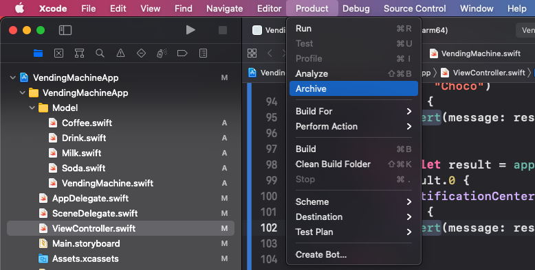
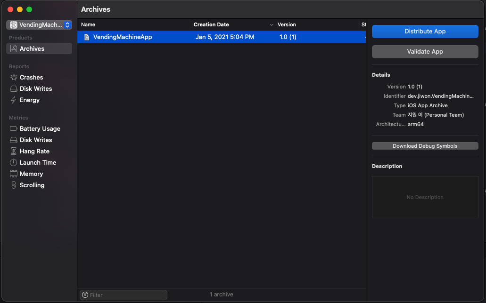
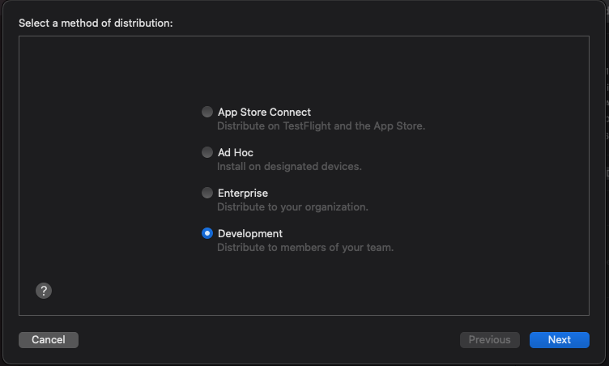

# App thinning에 대해서 설명하시오.

## App thinning

> 앱의 IPA 파일에 특정 장치에서 앱을 실행하는 데 필요한 리소스와 코드만 포함되도록 하는 기술

App Store에서 사용할 수 있고 TestFlight를 사용하여 테스터에게 배포하는 앱은 이미 App thinning을 사용하고 있다. 그러나 사내 엔터프라이즈 앱을 배포하거나 TestFlight를 사용하지 않고 테스터에게 빌드를 배포하는 경우 앱을 내보낼 때 App thinning을 활성화해야 한다. 

App thinning을 사용하려면:

1. 앱을 Xcode에 보관한다.
    

2. Organizer 창에서 보관된 앱을 선택하고 앱 배포를 클릭한다.

    

3. Xcode를 사용하여 앱을 내보내고 내보내기 시트에서 app thinning을 위해 `All compatible device variants`을 선택한다. 앱에서 제한된 수의 장치만 지원하는 경우 해당하는 장치를 선택한다.
    ```
    💡 더 진행해보고 싶지만 Apple Developer Program에 가입되어 있지 않아서 진행 불가
    ```
    

### Slicing (iOS, tvOS)

다양한 대상 장치 및 운영체제 버전에 대한 App Bundle의 변형을 생성하고 제공하는 프로세스

### Bitcode

컴파일된 프로그램의 중간 표현. 비트 코드가 포함된 App Store Connect에 업로드하는 앱은 App Store에서 컴파일 및 링크됨. 비트 코드를 포함하면 앱의 새 버전을 App Store에 제출할 필요없이 향후 앱 바이너리를 다시 최적화 할 수 있음

### On-Demand Resources (iOS, tvOS)

이미지 및 사운드와 같은 리소스로, 키워드로 태그를 지정하고 그룹으로 요청할 수 있음

더 나은 사용자 경험 제공

- 앱 크기가 작아 앱 다운로드 속도가 빨라져 최초 실행 환경이 개선됨
- 사용자가 앱을 탐색하는 동안 필요에 따라 백그라운드에서 On-Demand Resources를 다운로드함
- 운영체제는 디스크 공간이 부족하고 더 이상 리소스가 필요하지 않을 때 On-Demand Resources를 제거함

## 참고 자료

[](https://help.apple.com/xcode/mac/11.0/index.html?localePath=en.lproj#/devbbdc5ce4f)

[Apple Developer Documentation](https://developer.apple.com/documentation/xcode/reducing_your_app_s_size/doing_advanced_optimization_to_further_reduce_your_app_s_size)

[App Thinning in Xcode - WWDC 2015 - Videos - Apple Developer](https://developer.apple.com/videos/play/wwdc2015/404/)