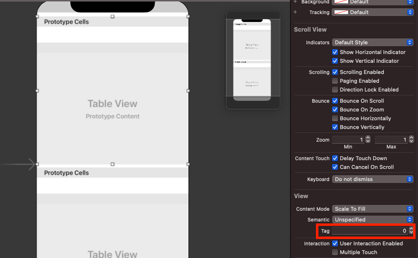

# 하나의 View Controller 코드에서 여러 TableView Controller 역할을 해야 할 경우 어떻게 구분해서 구현해야 하는지 설명하시오.

1. `viewDidLoad()` 에서 register 함수를 사용해서 셀을 등록한다.
    ```
    💡 스토리보드에서 만든 경우에는 등록할 필요가 없음!
    ```

    ```swift
    @IBOutlet weak var customTableView: UITableView!
    @IBOutlet weak var customTableView2: UITableView!

    override func viewDidLoad() {
    	customTableView.register(UITableViewCell.self, forCellReuseIdentifier: "cell")
    	customTableView2.register(UITableViewCell.self, forCellReuseIdentifier: "cell")
    }
    ```

2. `func tableView(_ tableView: UITableView, cellForRowAt indexPath: IndexPath) -> UITableViewCell` 에서 파라미터로 받는 `tableView`를 객체 비교를 통해 구분한다.

    ```swift
    func tableView(_ tableView: UITableView, cellForRowAt indexPath: IndexPath) -> UITableViewCell {
    	if tableView == customTableView {
    		// 구현		
    	} else if tableView == customTableView2 {
    		// 구현
    	}
    }
    ```

3. 테이블 뷰의 `Tag`를 등록, 비교해서 구분한다.

    ```swift
    func tableView(_ tableView: UITableView, cellForRowAt indexPath: IndexPath) -> UITableViewCell {
    	switch tableView.tag {
    		case 0:
    			// 구현
    		case 1:
    			// 구현
    		default: 
    			break
    	}
    }
    ```

    

## UITableView.register

```swift
func register(UINib?, forCellReuseIdentifier: String)
func register(AnyClass?, forCellReuseIdentifier: String)
```

인터페이스 빌더로 만든 셀의 경우 위의 함수를 사용, 코드로 만든 셀의 경우 아래의 함수 사용

- Cell을  재사용하기 위해서 등록할 때 사용함
    - 스토리보드는 자동으로 셀을 등록하기 때문에 별도의 등록을 하지 않아도 됨
    - ❗️ xib, code에 경우 등록해줘야 함

### 참고 자료

[iOS ) 하나의 델리게이트(Delegate)에 여러개의 요소 연결?](https://zeddios.tistory.com/169)