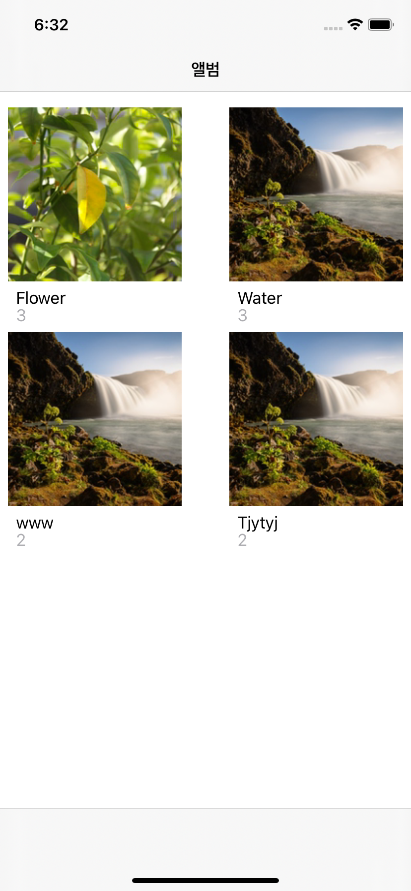
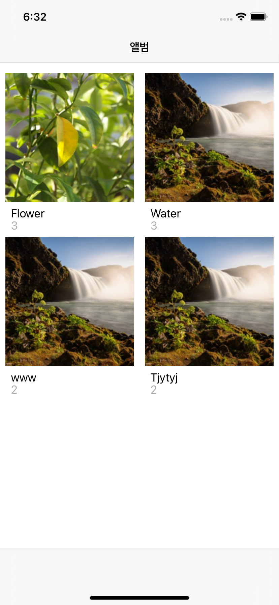

# UICollectionViewFlowLayout.itemSize와 UICollectionViewFlowLayout.estimatedItemSize
| use estimatedItemSize | use itemSize |
| --------------------- | ------------ |
|  |  |

부스트코스 프로젝트D. Album 첫번째 화면 구성부터 애먹었다. 왼쪽 이미지처럼 셀과 셀 사이의 간격이 줄어들지를 않아서, `flowlayout`의 프로퍼티를 이것저것 바꿔봐도 안됐다. 

```swift
let flowLayout: UICollectionViewFlowLayout = UICollectionViewFlowLayout()
flowLayout.sectionInset = .zero
flowLayout.minimumLineSpacing = 0
flowLayout.minimumInteritemSpacing = 0        
let halfWidth: CGFloat = UIScreen.main.bounds.width / 2.0
flowLayout.estimatedItemSize = CGSize(width: halfWidth - 16, height: halfWidth + 36)

self.collectionView.collectionViewLayout = flowLayout
```

`minimumLineSpacing`, `minimumInteritemSpacing` 애꿏은 프로퍼티의 수치만 바꾸고 있다가 `estimatedItemSize`를 `itemSize`로 바꿨다.

```swift
let flowLayout: UICollectionViewFlowLayout = UICollectionViewFlowLayout()
flowLayout.sectionInset = .zero
flowLayout.minimumLineSpacing = 0
flowLayout.minimumInteritemSpacing = 0        
let halfWidth: CGFloat = UIScreen.main.bounds.width / 2.0
// flowLayout.estimatedItemSize = CGSize(width: halfWidth - 16, height: halfWidth + 36)
flowLayout.itemSize = CGSize(width: halfWidth - 16, height: halfWidth + 36)
self.collectionView.collectionViewLayout = flowLayout
```

바꾸고나니까, 원하는 모양대로 출력이 잘 됐다. 

`estimatedItemSize` 에 대해서 설명을 흘려 봤기 때문에, Apple Developer 문서를 다시 봤다.

> `UICollectionViewFlowLayout.estimatedItemSize` 는 셀의 예상 크기를 지정하는 프로퍼티. 셀이 크기를 동적으로 조정할 때 `CollectionView`의 성능을 향상시킬 수 있다.
모든 셀의 크기가 같은 경우 `UICollectionViewFlowLayout.estimatedItemSize` 대신에 `itemSize` 속성을 사용하여 셀 크기를 지정한다.

모든 셀의 크기가 같은 경우에는 `itemSize`를 사용하란다. 이걸 몰라서 이틀을 삽질했네.... 이렇게 오늘도 배웠다.

### 참고 자료
[estimateditemsize](https://developer.apple.com/documentation/uikit/uicollectionviewflowlayout/1617709-estimateditemsize)