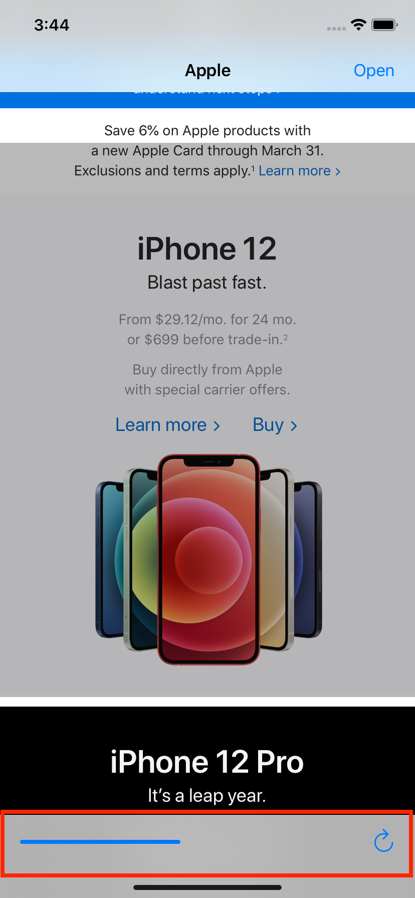

# UIToolbar

인터페이스 하단 가장자리를 따라 하나 이상의 버튼을 표시하는 컨트롤. 네비게이션 컨트롤러와 함께 동작한다.



## Using

툴바에 아이템을 추가하려면 `UIBarButtonItem` 클래스를 사용해야 한다.

```swift
override func viewDidLoad() {
    super.viewDidLoad()

    let refresh = UIBarButtonItem(barButtonSystemItem: .refresh,
                                  target: webView,
                                  action: #selector(webView.reload))

    toolbarItems = [refresh]
    navigationController?.isToolbarHidden = false
}
```

- 툴바에 `UIBarButtonItem` 추가하기
  - 직접 명시 → `toolbarItems = [item1, item2]`
  - 메서드 이용 → `setToolbarItems(item1, animated: true)`
- 툴바 숨김처리
  - 직접 명시 → `navigationController?.isToolbarHidden = false`
  - 메서드 이용 → `navigationController?.setToolbarHidden(false, animated: true)`

## 참고 자료
- [UIToolbar | Apple Developer Documentation](https://developer.apple.com/documentation/uikit/uitoolbar)
- [toolbarItems | Apple Developer Documentation](https://developer.apple.com/documentation/uikit/uiviewcontroller/1621867-toolbaritems)
- [setItems(_:animated:) | Apple Developer Documentation](https://developer.apple.com/documentation/uikit/uitoolbar/1617999-setitems)
- [toolbar | Apple Developer Documentation](https://developer.apple.com/documentation/uikit/uinavigationcontroller/1621882-toolbar)